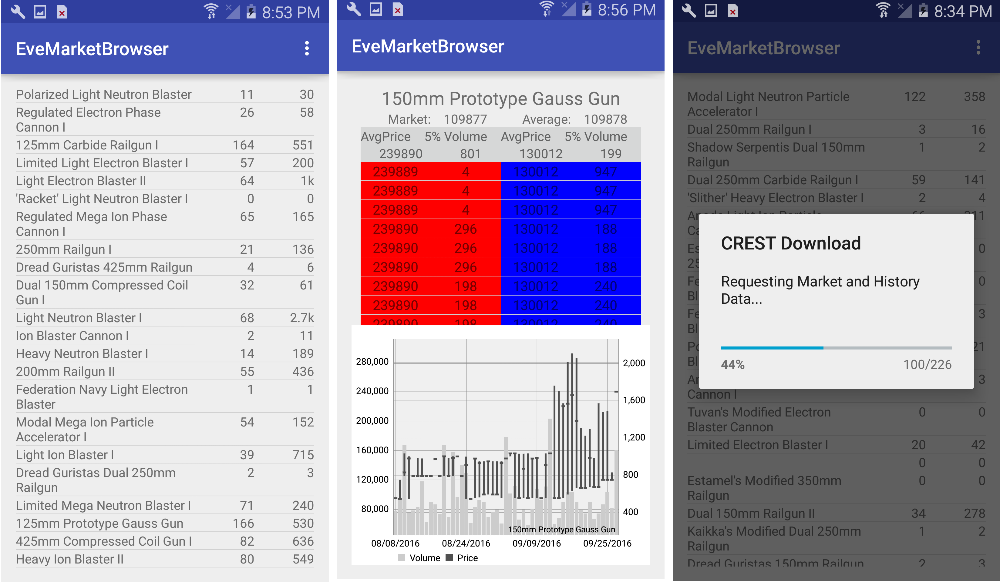

**Eve Market Browser**

An android app that pulls market data from a RESTFul API for the game Eve Online. Shows depth of market indicator and chart for each item.

Written around 2012-2014?

I wanted to learn how to make smartphone apps. I got an Android and IOS device, wrote a few apps for both of them.
This application was my most complicated Android app. 

Eve Online provided a RESTFul API called CREST that provided access to ingame data. This app pulled data about items for
sale on the ingame market, stored it locally in SQLite, and displayed market items on a list. Tapping an item would bring
up an activity with a depth of market and candlestick chart.

CREST was shut down in 2018 and replaced with a new RESTFul API named ESI.

* evemarketbrowser
    * DatabaseHandler.java - Provides SQLite access
    * DOMandChartActivity.java - Depth of market indicator and candlestick chart
    * FragmentDomSplitWithHeader.java - Fragment for the Chart activity
    * HistoryDay - Holds one day of history data
    * MarketBrowserActivity.java - Main activity
    * MarketContainer.java - Holds data for a single market item
    * MarketOrder.java - Holds data for a single market order, either buy or sell
    * MarketOverviewListAdapter.java - ListAdapter for main item list
    * MyDOMArrayAdapter.java - Adapter for depth of market rows
    * MyRequestQueueSingleton.java - Singleton that provides a RequestQueue
    * MyServiceDataSingleton.java - Singleton that handles loaded data
    * MyVolleyReceiver.java - Receiver for Volley downloader
    * MyVolleyService.java - Volley downloader service
    * NumberFormatter.java - Shrinks numbers with a suffix (1,000,000 -> 1M))

**Screenshots**

